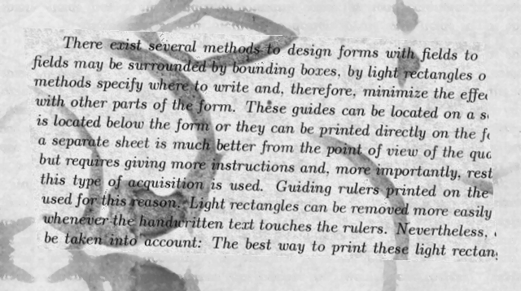
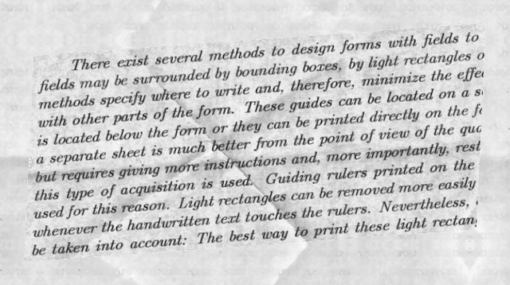
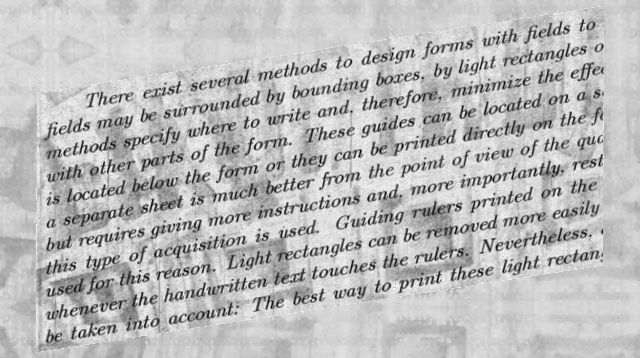
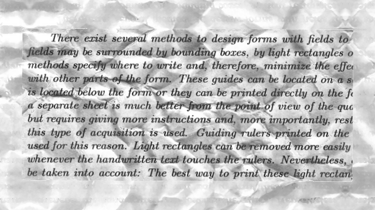
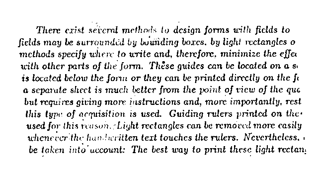
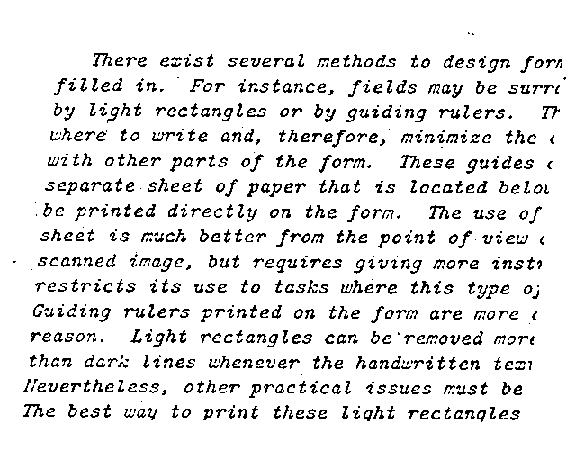

# Desafio (Document Cleanup)

1. [Solução proposta](#solucao_proposta)

   1.1 [Análise do problema](#analise)

   1.2 [Análise do dataset](#dataset)

   1.3 [Solução](#solucao)

2. [Resultados](#resultados)

3. [Rodar código](#codigo)

   3.1 [Instalação](#instacao)

   3.2 [Rodar algoritmo](#algoritmo)

4. [Melhorias](#melhorias)

5. [Conclusão](#conclusao)

<a name=solucao_proposta />

## 1. Solução proposta

<a name=analise />

### 1.1 Análise do problema

O desafio propôrem o desenvolvimento de um algoritmo de processamento de imagem para a manipulação de imagens com ruido no background, com o objetivo de realizar a leitura do texto presente em cada imagem. O algoritmo desenvolvido tem que ser robusto o suficiente para extrair todos os tipos de ruído e possibilitar a leitura do texto. Somente a imagem ruidosa está disponível, a referência de como deveria ser o output correto não foi fornecida.

<a name=dataset />

### 1.2 Análise do dataset

O dataset consiste em imagens com alguns padrões de ruino no background. Observando o dataset podemos ver quatro tipos de padrões de ruino no background.

<a name=solucao />

### 1.3 Solução

A solução proposta para resolver este desafio foi aplicar algoritmos de processamento de imagem para viabilizar a leitura do texto. O desenvolvimento foi dividido nas seguintes tarefas:

* **Remover o ruído do background**: Para remover o ruído do background foi utlizado um boramento médio dos pixels da imagem para evidenciar o ruido do background e posteriormente subtrair o ruido da imagem original. Desta forma, obtemos uma imagem com menor interferência do ruido.

* **Alinhamento do texto na horizontal**: A maioria dos textos fornecidos nas imagens não estão na horizontal, o que dificulta a leitura do texto para os algoritmos de visãoo computacional. Com o intuito de facilitar a leitura, os textos foram rotacionados para ficarem na horizontal. Para realziar o rotacionameno, foi utilizado o algoritmo de Hough Line Transform que permite identificar retas na imagem. Se traçarmos uma reta na linha de cada texto da imagem será possível indentificar a inclinação do texto e rotacionar para ficar na posição horizontal. Desta forma foi aplicado a Hough Line Transform na imagem e após calcular a inclinação média de todas as retas do texto, foi possível obter o ângulo do texto e aplicar uma rotação no mesmo para ficar na horizontal.

* **Leitura do texto**: Para realizar a leitura dos textos foi utilizado o pytesseract que facilita o uso do Tesseract que é uma biblioteca utilizada para a leitura de caracteres. 

<a name=resultados />

## 2. Resultados

Os resultados obtidos com o processamento das imagens podem ser vistos na pasta output na raiz do projeto. Abaixo alguns exemplos:

**Imagem**

**Texto**
There exist several methods to design forms with ficlds to
fields may be surrounded by buuiiding bores. by lighi rectangles 0
methods specify where to write and, therefore, minimize the effer
with other parts of the form. Thése guides can be located on a &
is located below the form or they can be printed directly on the fe

a separute shect is much better from the point of view of the que
but requires giving more. justructions and, more importantly, rest
this type of acquisition is used. Guiding rulers printed on the-
used for this reason. “Light rectangles can be removed more easily
whenecver'the hun.heritten text touches the rulers. Nevertheless. «
be daken into’ uccount: The best way to print these light rectam

**Imagem**

**Texto**
There exist several methods to design fors
filled in. For instance, fields may be surrc
by light rectangles or by guiding rulers. T?
where to write and, therefore, minimize the ¢
with other parts of the form. These guides «
separate sheet of paper that is located belo
be printed directly on the form. The use of
Sheet ts much better from the point of view ¢

scanned image, but requires giving more instr
restricts its use to tasks where this type oj
Guiding rulers printed on the form are more «
reason. Light rectangles can be'removed more
than dark lines whenever the handwritten tez1
evertheless, other practical issues must be
The best way to print these light rectangles

<a name=codigo />

## 3. Rodar código

<a name=instacao />

### 3.1 Instalação

Neste projeto foi utilziado `docker` e `docker-compose` para facilitar a instação das bibliotecas necessárias para rodar o código. Com isso é necessários instalar as duas ferramentas no computador. Após a instalação, proceder da seguinte forma:

- **Criar as imagens**: Para criar as imagens ir para a raiz do projeto onde está localizado o arquivo `docker-compose.yaml` e rodar o seguinte comando `docker-compose build`.

- **Criar os containers**: Para criar os containers ir para a raiz do projeto onde está localizado o arquivo `docker-compose.yaml` e rodar o seguinte comando `docker-compose up -d`.

- **Acessar o container**: Após criar os containers para acessar o container onde está o código, rodar o seguinte comando `docker-compose exec python bash`.

O código foi implementado no arquivo disponibilziado na pasta `code` chamado `process_image.py`.

<a name=algoritmo />

### 3.2 Rodar algoritmo

Para rodar o algoritmo de processamento das imagem:

`python3 process_image.py`

Após a finalização do algoritmo, as imagens e os respectivos textos lidos serão disponibilizados na pasta `output`.

<a name=melhorias />

## 4. Melhorias

A solução proposta possui alguns pontos de melhorias:

- **Melhoria na remoção do ruído**: O algoritmos para remoção de ruído em alguns casos não conseguem extrair todos os ruidos. Desta forma, a leitura do texto fica prejudicada devido a imperfeições no texto. Um estudo pode ser realizado para analisar uma técnica melhor para remover os ruídos apresentados.
- **Melhor solução para rotação do texto**: A rotação utilizando Hough Line Transform foi uma solução que atendeu as imagens deste desafio, porém não é uma solução robusta que generalize satisfatoriamente. Um estudo mais aprofundado pode ser realizado para analisar uma técnica que fornece uma robustez melhor.
- **Escalabilidade**: A solução apresentada não é escalonável. Uma melhoria que pode ser implementada é utilizar as imagens processadas como ground truth e treinar uma rede neural profunda para realizar a inferência. Uma solução seria implementar a estrutura Autoencoder para realizar a remoção de ruído das imagens. Infelzimente essa opção não foi implementada devido ao tempo disponível para a realização dos desafios.
- **Informação hardcodada**: Algumas informações foram hardcodada no código. Uma melhor prática seria utilizar um arquivo de configuração separado (Ex: json), onde estas informações seriam armazenadas.
- **Apresentação texto lido**: Em algumas respostas do texto lido da imagem aparecem alguns caracteres especiais. Ele foram deixados para melhor vizualização da eficiência do algoritmo de leitura, porém idealmente seria melhor removê-los.
- **Testes**: Incluir testes unitários para facilitar a integração de novas funcionalidades.

<a name=conclusao />

## 5. Conclusão

O desafio foi bem interessante devido a não termos acesso ao ground truth e dos diferentes tipos de ruído das imagens. Foi uma excelente oportunidade para aprender novos conceitos e explorar soluções.