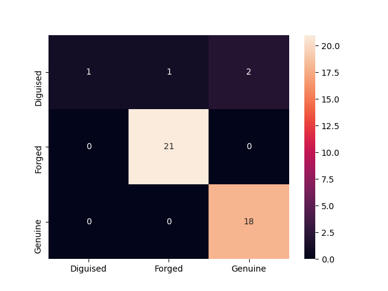
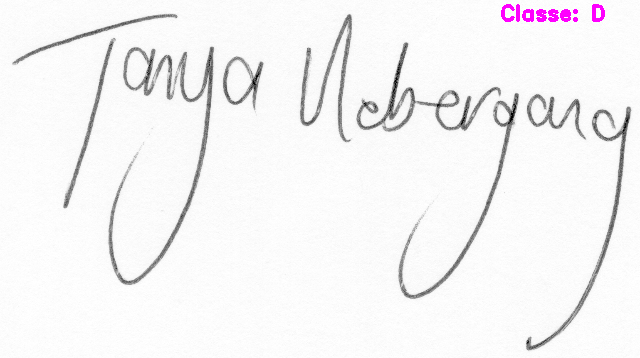
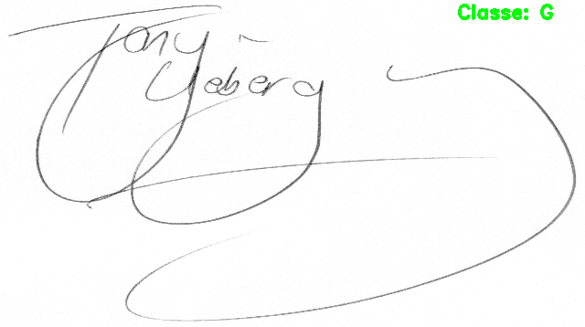
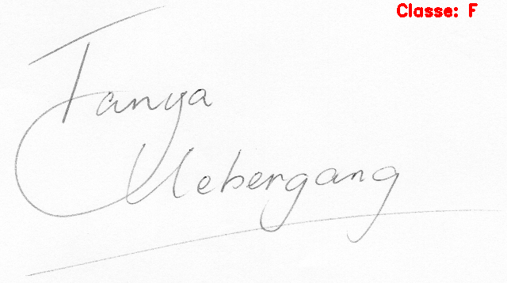

# Desafio (FraudDetection)

1. [Solução proposta](#solucao_proposta)

   1.1 [Análise do problema](#analise)

   1.2 [Análise do dataset](#dataset)

   1.3 [Solução](#solucao)

2. [Resultados](#resultados)

3. [Propostas soluções (classe Reference)](#proposta)

4. [Rodar código](#codigo)

   4.1 [Instalação](#instalacao)

   4.2 [Treinamento](#treinamento)

   4.3 [Inferência](#inferencia)

5. [Melhorias](#melhorias)

6. [Conclusão](#conclusao)

<a name=solucao_proposta />

## 1. Solução proposta

<a name=analise />

### 1.1 Análise do problema

O desafio propõem o desenvolvimento de um modelo de classificação de assinaturas de uma pessoa, sendo que ela pode ser classificada como Genuine, Forged ou Diguised. A grande dificuldade deste desafio é a sugestão de utilizar para treinar o modelo as assinaturas da classe Reference que contém 9 amostras.

<a name=dataset />

### 1.2 Análise do dataset

O dataset fornecido possui a seguinte configuração :

| Classe        | Imagens |
| :---:         |  :---:  |
| Genuine       | 76      |
| Reference     | 9       |
| Forged        | 104     |
| Diguised      | 20      |

Como podemos ver existe um desequilíbrio na quantidade de imagens para a classe Diguised e Reference em relação as outras classes (Genuine e Forged). 

**Observação**: No enunciado do desafio foi solicitado para a saída do modelo considere as três classes: Genuine, Forged e Diguised. Como as classes Genuine e Reference representam assinaturas verdadeiras da pessoa, foram consideras neste desafio como pertencentes a classe Genuine. Desta forma a configuração final do dataset ficou da seguinte forma:

| Classe        | Imagens |
| :---:         |  :---:  |
| Genuine       | 85      |
| Forged        | 104     |
| Diguised      | 20      |

<a name=solucao />

### 1.3 Solução

A solução proposta utiliza todas as imagens das classes disponiblizadas. Esta solução foi adotada devido a melhor performance apresentada. Um esforço foi realizado para apresentar uma solução que somente utilize a classe Reference para o treino, porém não obtive uma solução satisfatória que atenda o prazo de realização do desafio. Na seção Propostas soluções (classe Reference) foram apresentada algumas propostas.  O desenvolvimento foi dividido nas seguintes tarefas:

- **Separação do dataset**: A separação adotada do dataset foi 80% para treino e 20% para teste.
- **Definição da quantificação da imagem**: Para treinarmos um algoritmo de classificação temos que fornecer dados que ajudem a classificar corretamente as classes. Para descrever a imagem para o algoritmo de classfificação foi utilizado o descritor de image HOG (Histogram of Oriented Gradients), que extrai características da imagem.  
- **Definição do algoritmo de classificação**: O algoritmo de classificação utilizado foi o Random Forest, que apresentou o melhor resultado para a aplicação.
- **Treino**: O modelo foi treinado utilizando as características obtidas das images.
- **Avaliação do modelo**: Após o treino, a acurácia do modelo foi avaliada utilizando o dataset de teste que consiste em imagens que não foram utilizadas no treinamento.

<a name=resultados />

## 2. Resultados

O modelo de classificação de assinatura desenvolvido obteve uma acurácia de **93%** utilizando o dataset de teste. Abaixo segue a matrix de confusão do modelo treinado. 

**Matrix de confusão**

O maior porcentual de erro obtido com o modelo foi na classificação da classe Diguised devido a baixa quantidade de amostras disponíveis para treinamento.

Abaixo exemplos da inferência do modelo:

**Classe: Diguised**

**Classe: Genuine**

**Classe: Forged**

<a name=proposta />

## 3. Propostas soluções (classe Reference)

Abaixo as propostas para resolver o desafio utilizando somente a classe Reference para treino:

- **Dataset**: Obter um dataset com maior quantidade de dados e treinar o modelo proposto nesta solução. Uma opção seria utilizar o dataset [University of Tehran Persian Offline Signature Dataset](http://mlcm.ut.ac.ir/Datasets.html). Incluir as imagens fornecidas na categoria Genuine do dataset e treinar o modelo. Após o treino efetuar a avaliação da performance do modelo nas outras classes disponibilizadas. Caso o resultado não seja satisfatório, uma possibilidade é utilizar as classes Genuine e Reference disponibilizadas na categoria Genuine do dataset, desta forma vamos ter mais exemplos para o modelo treinar.

- **Modelo treinado**: Retreinar um modelo que já foi treinado para realizar essa tarefa utilizando as imagens fornecidas da classe Reference. Desta forma, vamos utilziar a expertise do modelo para realizar a inferência das imagens. A quantidade de imagens fornecidas para treino será um desafio para que o modelo generalize satisfatoriamente. Caso o resultado não seja satisfatório, uma possibilidade é utilizar as imagens das classes Genuine e Reference disponibilizadas, desta forma vamos ter mais exemplos para o modelo treinar.

<a name=codigo />

## 4. Rodar código

<a name=instalacao />

### 4.1 Instalação

Neste projeto foi utilziado `docker` e `docker-compose` para facilitar a instação das bibliotecas necessárias para rodar o código. Com isso é necessários instalar as duas ferramentas no computador. Após a instalação, proceder da seguinte forma:

- **Criar as imagens**: Para criar as imagens ir para a raiz do projeto onde está localizado o arquivo `docker-compose.yaml` e rodar o seguinte comando `docker-compose build`.

- **Criar os containers**: Para criar os containers ir para a raiz do projeto onde está localizado o arquivo `docker-compose.yaml` e rodar o seguinte comando `docker-compose up -d`.

- **Acessar o container**: Após criar os containers para acessar o container onde está o código, rodar o seguinte comando `docker-compose exec python bash`.

O código foi divido em dois arquivos disponibilizados na pasta `code`:

- `model_training.py`: Arquivo utilizado para realizar o treinamento do modelo de classificação.
- `model_inference.py`: Arquivo para rodar a inferência do modelo gerado.

<a name=treinamento />

### 4.2 Treinamento

Para realizar o treinamento do modelo, rodar o seguinte comando:

`python3 model_training.py`

Após a finalização do treinamento, o modelo será gravado na pasta code com o nome `model.pkl`. Na tela será apresentada informaçãoes da matrix de confusão e acurácia do modelo.

<a name=inferencia />

### 4.3 Inferência

Para realizar a inferência do modelo, rodar o seguinte comando:

`python3 model_inference.py -i 'path_to_image_file'`

A classe inferida será apresentada na tela, assim como a imagem com a classe discriminada.

<a name=melhorias />

## 5. Melhorias

A solução proposta possui alguns pontos de melhorias:

- **Dataset**: O dataset foi separado manualmente neste desafio, porém existe a possibilidade de criar um script para organizar o dataset conforme requerido automaticamente. 
- **Informação hardcodada**: Algumas informações foram hardcodada no código. Uma melhor prática seria utilizar um arquivo de configuração separado (Ex: json), onde estas informações seriam armazenadas.
- **Parâmetros de avaliação do modelo**: Outros parâmetros poderiam ser disponibilziados para melhor avaliação do modelo como por examplo: precision score , recall score e f1 score.
- **Testes**: Incluir testes unitários para facilitar a integração de novas funcionalidades.

<a name=conclusao />

## 6. Conclusão

O desafio foi bem interessante devido a complexidade. Foi uma excelente oportunidade para aprender novos conceitos e explorar soluções.